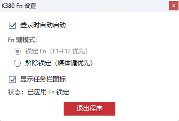

# K380 Fn Auto Lock for Windows

让 Logitech K380 在 Windows 上默认使用 F1–F12，并在键盘重新连接或电脑唤醒后自动恢复 Fn 设置。

## 相较于一次性手动设置工具

| 使用场景 | 本项目提供的能力 |
| --- | --- |
| 电脑重启后 Fn 设置失效 | 可设置开机时自动启动，并重新应用 Fn 设置 |
| 键盘断连或切换蓝牙通道后切回电脑 | 监听设备变化和蓝牙连接，自动重试恢复 |
| Windows 未提供连接通知 | 定期补写 Fn 设置作为兜底 |
| 需要切换 Fn 模式 | 从托盘菜单或简洁设置窗口切换，无需每次手动运行命令 |

## 功能

- 可设置开机时自动启动
- 从托盘菜单或简洁设置窗口切换 Fn 锁定和媒体键优先
- 可隐藏托盘图标，后台继续运行
- 只匹配 K380 型号，无需填写蓝牙地址

## 下载和使用

从 [GitHub Releases](https://github.com/OrlandoHsu29/k380-fn-autolock/releases) 下载 Windows x64 压缩包，解压后运行 `k380FnAutoLock.exe`。首次手动启动会直接打开设置窗口。请将 `hidapi.dll` 与程序放在同一文件夹。

右键托盘图标可打开菜单，启用“开机时自动启动”可在开机后自动运行。隐藏图标后，手动再次打开 exe 会显示设置窗口。

## 界面预览

## 参考项目

项目设备命令参考了 [dheygere/k380-fn-lock-for-windows](https://github.com/dheygere/k380-fn-lock-for-windows)、[k810fn](https://github.com/keighrim/k810fn/blob/master/win/k810fn/k810fnCLI.cpp) 和 [k380-function-keys-conf](https://github.com/jergusg/k380-function-keys-conf/blob/master/k380_conf.c)。HIDAPI 来源于 [libusb/hidapi](https://github.com/libusb/hidapi)，其 BSD 授权文本随仓库附带。
